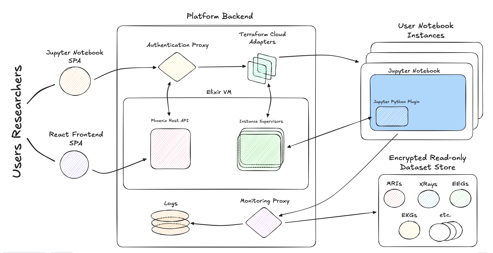
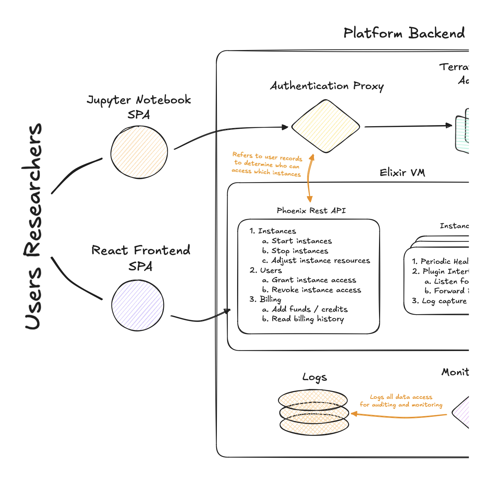
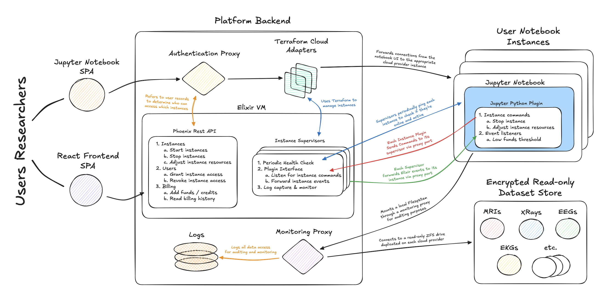

# [RFC] Instance Usage Monitoring & Billing

This document is an example RFC that I'm writing for the Storacha interview process.
For this example, I've chosen some of the work I did on my last project as a consultant at Carbon Five, Nightingale Open Science.
For Nightingale, I led development of the initial MVP from conception to launch with a team of three that grew to seven by the time the project ended.
Since leaving Carbon Five, I've kept up with Nightingale, and I'm very proud to say that the platform we built has since led to some real progress in the areas of breast cancer detection and tuberculosis treatment.
Find more about Nightingale's work on [their blog](https://www.ngsci.org/updates).

## Author

- [rosalinekarr]

## Background

Nightingale Open Science is a non-profit spun out of the University of Chicago focusing on supporting machine learning researchers working in the medical space with the goal of advancing medical science and improving real-world outcomes for patients.
To this end, Nightingale has already secured grants in the form of both direct funding and credits for free resource usage on Azure and AWS.
Additionally, Nightingale has exclusive access to large collections of volunteer medical records including MRI scans, X-rays, EEGs, EKGs and medical studies collected by the University of Chicago's medical school.
These records were approved for ML research use by patients, but they still come with a high degree of sensitivity due to HIPAA restrictions and PII inherit in the records, so their use needs to be strictly controlled and monitored.
Nightingale's plan is to offer access to these resources in a secure environment either free for other non-profit researchers and at a usage-based billing rate for private researchers which would then subsidize further non-profit work.

## Goals

1. Build a platform where machine learning researchers can train and run models on Nightingale's datasets.
1. The platform must be as secure as reasonably possible, especially with regard to Nightingale's medical data.
1. The platform should support multi-cloud as much as possible to take advantage of Nightingale's server credit grants.
1. The platform should be familiar to ML researchers and therefore lean on existing ML UI patterns and tools.
    a. Users are technologically experienced and tend to prefer bare-bones GUIs.
    a. Users are very familiar with command line tools and enjoy working with them.
1. Development should prioritize speed due to fundraising-related deadlines.

## Overview

Our solution for Nightingale's platform consists of three new applications in combination with the existing tools, Jupyter Notebook and the Terraform.
The three bespoke apps are a frontend React UI, an Elixir-Phoenix backend server, and a special Python CLI app for use within research instances.
We'll use Jupyter Notebook for the actual research work, since most researchers are already familiar with it.
We'll use Terraform for managing instances across various clouds, since Terraform standardizes each cloud's unique APIs and Kubernetes does not yet support attaching the GPU resources we need.
We'll also use standard proxy services and network drives for each cloud provider to host Nightingale's data and secure it.

A general diagram of the system follows:

### User-Facing Application

On the user-facing aspect of the system, researchers will interact with two single-page applications: our bespoke React app for managing instances and interacting with the Nightingale API; and the Jupyter Notebook UI.
Our frontend app will interact with Nightingale's backend REST API written in Elixir Phoenix to take advantage of the Erlang VMs concurrency tooling for instance monitoring and the team's familiarity with the framework.
The Jupyter UI will interact with a proxy endpoint using the API to associate authenticated users with their instances and forward requests and responses accordingly.

### Backend Instance Management

For managing user instances, the Nightingale backend server will use concurrent Erlang processes to run instance supervisors responsible launching and shutting down instances, monitoring their status and proxying interactions with instances from users and other automated features.
These supervisor processes will use Terraform to allocate resources, start instance servers, and stop servers across AWS EC2, Azure VMs, and GCP Cloud Run.
These supervisors can also poll the built-in `/api` endpoint in Jupyter API once a second to check when a notebook server has successfully started and whether instances are still running.
This information can then be used to update billing for applicable accounts and to monitor for server crashes.

The individual Jupyter Notebook servers will run a custom fork of the standard Jupyter Notebook docker container pre-configured to mount a read-only ZFS drive including Nightingale's exclusive training data.
Reads from these notebooks on the training data drive will also be proxied through a monitor to log all files accessed, when, for how long and by who, for auditing and monitoring.
This auditing can be done with any off-shelf logging analysis tool, such as Datadog or Kibana.
Such tools can also be used to monitor for large files transfers indicating that uses may be attempting to exfiltrate Nightingale's sensitive and proprietary data.

### Python CLI Tool

The forked Jupyter Notebook container will include a pre-installed Python CLI tool written for interacting with the Nightingale instance supervisor from within an instance.
This tool should enable researchers to implement many commonly requested features for research platforms themselves, including automatically shutting down notebooks once training is complete, automatically resizing instances between training runs, and notifying the researcher in the event of an error.

## Open Questions

1. What resources should be user configurable and how?
    a. Should we use a t-shirt sizing system, i.e. small, medium, large instances?
    a. If so, should that system be per-resource or overall? Should users be able to combine a "small" CPU package with a "large" GPU package?
    a. If not, at what granularity should we allow users to specify resources?
1. What sort of monitors are necessary to provide the degree of security we want in the platform?
    a. Large file download monitor?
    a. Honeypots?

## Next Steps

1. Write a more detailed definition of the Nightingale Backend server, including authentication methods, API definitions, and billing policies.
1. Write a more detailed definition of the Nightingale Instance supervisor, including Terraform config files for each cloud provider and proxy policies.
1. Break the actionable setup above, including initial server and repository setups, into feature stories for planning, estimation and implementation.